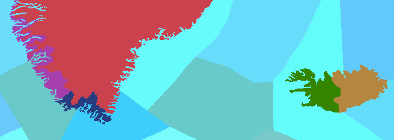
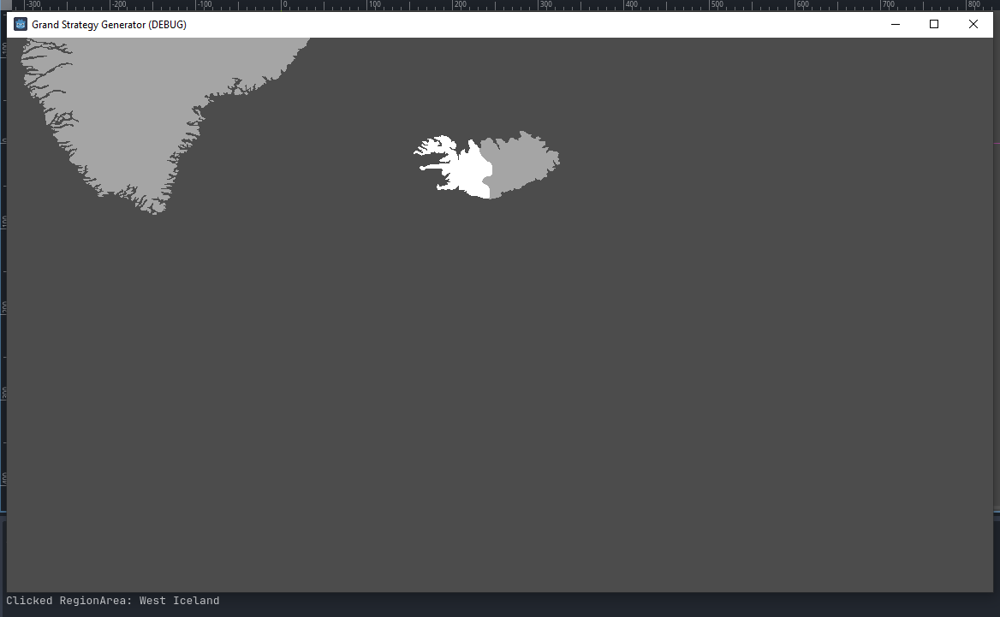

# Godot Grand Strategy Generator
Generate 2D map based on an color coded image and json data. (Paradox like)

Color coded image example: 


json data: 
```"#348400": "West Iceland"```

Generated map example:

